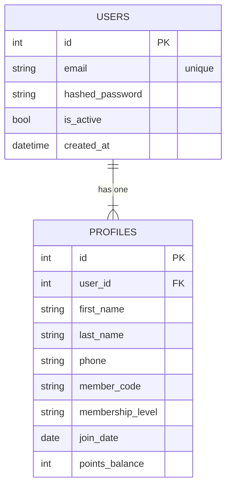

# Database ER Diagram

Below is the ER diagram representing the current schema (`users`, `profiles`).

```mermaid
erDiagram
    USERS {
        int id PK
        string email "unique"
        string hashed_password
        bool is_active
        datetime created_at
    }

    PROFILES {
        int id PK
        int user_id FK
        string first_name
        string last_name
        string phone
        string member_code
        string membership_level
        date join_date
        int points_balance
    }

    USERS ||--|{ PROFILES : "has one"
```
